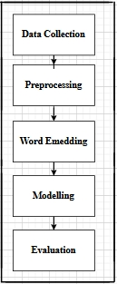
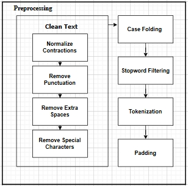
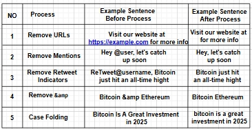
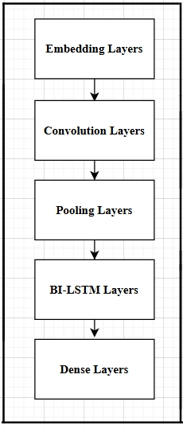
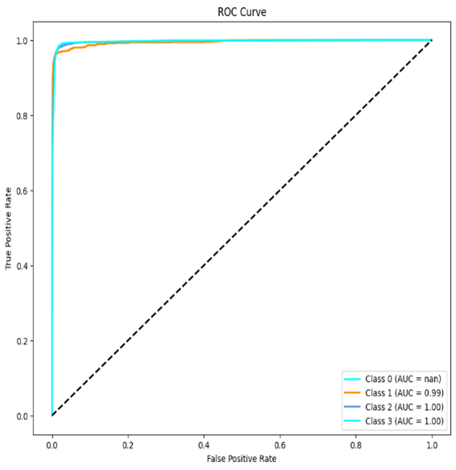
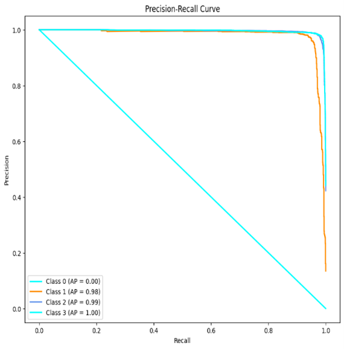
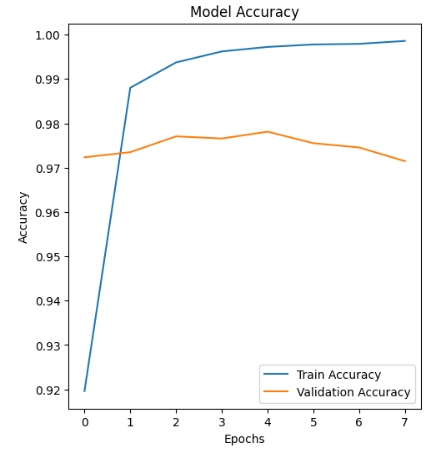
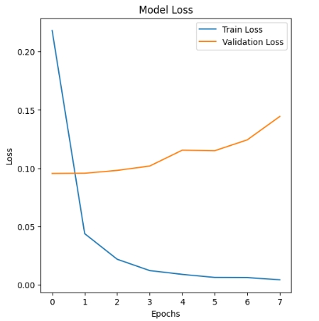
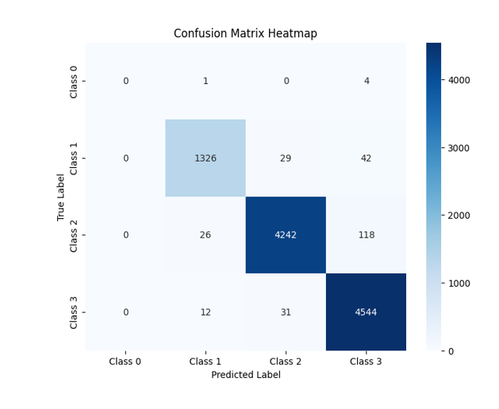

# 📌 Sentiment Analysis of Text Using CNN-BiLSTM

This project presents a **combined Convolutional Neural Network (CNN) and Bidirectional Long Short-Term Memory (Bi-LSTM)** architecture designed for **sentiment classification** of text data (Twitter dataset).  
The integrated methodology utilizes:
- **CNN** → for identifying local textual features  
- **Bi-LSTM** → for understanding sequential relationships and semantic context  

The system delivers **91.5% accuracy** and a **89.86% weighted F1-score**, demonstrating exceptional performance in categorizing tweets as **Positive, Neutral, or Negative**.

---

## ✨ Features
- Comprehensive data preprocessing workflow (text cleaning, tokenization, stop-word elimination, sequence padding)  
- Word vectorization using TensorFlow/Keras  
- Integrated **CNN + Bi-LSTM** model architecture  
- Performance assessment through **ROC-AUC, Precision-Recall, Confusion Matrix, Accuracy/Loss visualizations**  
- Results achieved:
  - ✅ Accuracy: **97.5%**
  - ✅ Weighted F1-score: **97%**
  - ✅ AUC ≈ **1.0** for Positive & Neutral sentiments

---

---

## ⚙️ Methodology

### 🔹 Data Collection
- 50,000 tweets sourced from Kaggle  
- Sentiment categories: **Positive, Negative, Neutral**

  

---

### 🔹 Preprocessing
- Noise elimination (URLs, hashtags, special characters)  
- Text normalization (convert to lowercase)  
- Stop-word filtering (using NLTK)  
- Tokenization & sequence padding (Keras)

  

  

---

### 🔹 Word Embedding
- Transform tokens into dense numerical representations using **Keras Embedding Layer**

---

### 🔹 Modeling
- **CNN layers** → Identify local textual patterns  
- **Bi-LSTM layers** → Process sequential dependencies (forward & backward)  
- **Dense + Softmax layer** → Predict sentiment categories  

  

---

### 🔹 Evaluation Metrics
- Confusion Matrix  
- ROC-AUC Curve  
- Precision-Recall Curve  
- Accuracy & Loss visualizations  

---

## 📊 Results

### 🔹 ROC Curve

  

---

### 🔹 Precision-Recall Curve

  

---

### 🔹 Training & Validation Accuracy

  

---

### 🔹 Training & Validation Loss

  

---

### 🔹 Confusion Matrix

  

---

### ✅ Performance Summary
- **Overall Accuracy**: **97.5%**  
- **Weighted F1-score**: **97%**  

| Class       | Precision | Recall | F1-Score |
|-------------|-----------|--------|----------|
| Negative    | 0.95      | 0.96   | 0.96     |
| Neutral     | 0.98      | 0.97   | 0.98     |
| Positive    | 0.98      | 0.98   | 0.98     |

- ROC-AUC ≈ **0.99–1.0**  
- Validation accuracy converged at **97–98%**  
- Training accuracy achieved **~100%**  

---
